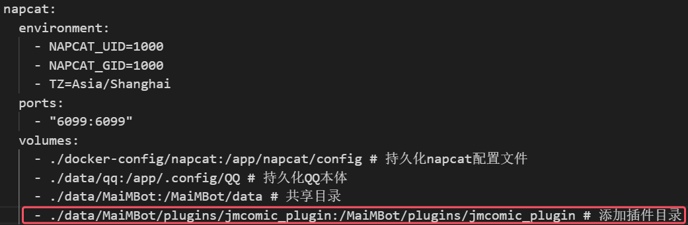

> [!WARNING]
>
> **重要通知：请仔细阅读以下内容后方可使用本项目。**
>
> 该插件可能包含成人内容，通过访问本项目，您**郑重声明并保证**您已年满【18】周岁（或您所在司法管辖区的法定成年年龄），并且您所在社区的法律允许您访问此类成人内容。
>
> 禁止使用该插件**传播成人内容至禁止此类内容的公共平台**，您对访问及使用本项目造成的不良后果承担全部责任
>
> 

# JMComic（禁漫天堂） 插件

*制作者水平稀烂，任何疑问或bug或建议请联系qq：1523640161* 

## 概述

JMComic（禁漫天堂）插件v0.3.0，定时或随机获取漫画，在QQ随时观看和与群友分享喜欢的漫画

## 功能

- **使用说明**:  匹配 `/jm help`命令，获取指令的使用说明
- **根据ID下载**：匹配 `/jm <漫画ID>`命令，下载指定漫画并获取简介
- **随机漫画下载**：匹配 `/jm random`命令，下载周榜随机漫画并获取简介
- **分类搜索**：匹配 `/jm random tags=<tag>[,<tag>...]`命令，下载标签含tag的随机漫画并获取简介
- **权限管理**：在配置中规定谁可以使用本指令，避免恶意攻击
- **定时发送**：开启此功能定时获取指定tag或随机漫画至群、用户

## 使用方法

### 安装插件

1. 克隆本仓库

   ```bash
   git clone https://github.com/internetsb/jmcomic_plugin.git
   ```
2. 将 `jmcomic_plugin\`文件夹放入 `MaiBot\plugins`文件夹下
3. 安装相应依赖(部分依赖MaiBot已安装)，示例：

   ```bash
   #说明：reportlab与PyPDF2为可选项，仅在enable_pdf启用时需要
   #pip安装，在MaiBot文件夹下
   .\venv\Scripts\activate
   cd .\plugins\jmcomic_plugin\
   pip install -i https://mirrors.aliyun.com/pypi/simple -r .\requirements.txt --upgrade
   #uv安装，在plugins\jmcomic_plugin文件夹下
   uv pip install -r .\requirements.txt -i https://mirrors.aliyun.com/pypi/simple --upgrade
   #一键包用户可在启动时选择交互式安装pip模块，安装jmcomic，pyzipper，reportlab，PyPDF2
   #docker安装，宿主机内
   docker exec -it maim-bot-core uv pip install jmcomic pyzipper reportlab PyPDF2 --system
   ```
4. 启动一次麦麦自动生成 `config.toml`配置文件，成功生成配置文件即说明读取插件成功（未生成配置文件请检查启动麦麦时的加载插件日志）

> [!IMPORTANT]
>
> **Docker部署使用方法**
>
> 修改docker-compose.yml以共享传输文件
>
> **修改docker-compose.yml中的napcat volumes**
>
> 添加
>
> `- ./data/MaiMBot/plugins/jmcomic_plugin:/MaiMBot/plugins/jmcomic_plugin # 添加插件目录`
>
> 

### 修改配置文件

请设置：

1. 权限名单及类型
2. 解压密码

更多配置请看config.toml中的注释

### （可选）高级配置

查看插件目录下的option.yml文件，可修改下载流量等配置，参考注释及原项目指南-[配置文件详解](https://github.com/hect0x7/JMComic-Crawler-Python/blob/master/assets/docs/sources/option_file_syntax.md)

### 快速开始

**配置权限**：在config.toml中填写权限名单及类型

**发送命令**：向麦麦发送命令：`/jm 350234`  正常情况下，等待几秒后麦麦将上传文件压缩包或pdf、发送提醒及漫画简介

## 鸣谢

[MaiBot](https://github.com/MaiM-with-u/MaiBot)

原仓库：[JMComic-Crawler-Python](https://github.com/hect0x7/JMComic-Crawler-Python)
